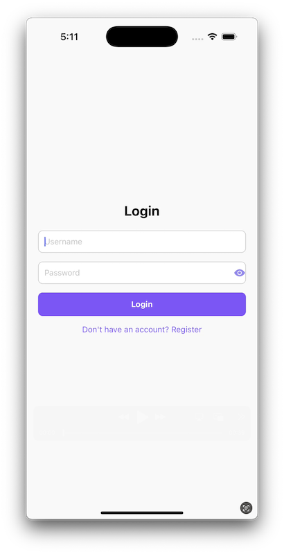
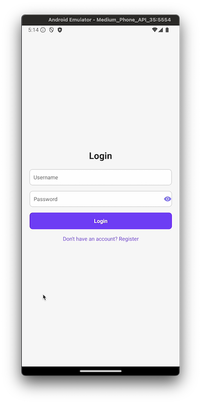
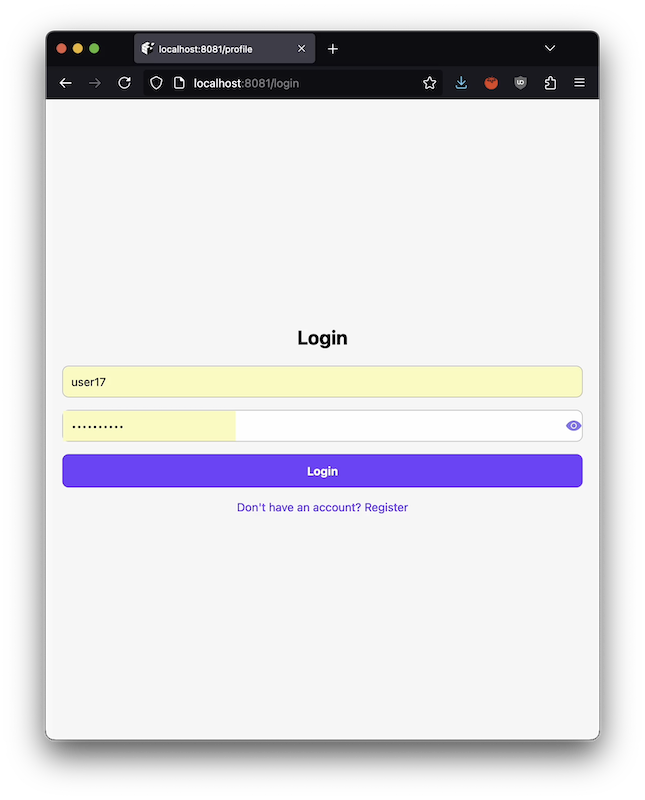

# To-Do-App

A To-Do App that features a simple and secure login system using authorization (session-based) JWT tokens to make sure only authorized users can access their data. The app works on iOS, Android, and Web, so you can use it on your phone, tablet, or computer. It connects to a local server, and can store your tasks and keeps everything safe and up to date. It's designed to be easy to use, fast, and secure!
Built with Expo React Native, Express, and MongoDB.

## Demo Video

### iOS Simulator:
[](https://github.com/user-attachments/assets/312cc1b3-3c99-4d2b-9fb4-e6c44c52acb0)

### Android Emulator:

[](https://github.com/user-attachments/assets/6665960d-8b1c-4850-8264-7d7960226760)

### Web browser:

[](https://github.com/user-attachments/assets/b6a11ca7-8872-4cc9-84f0-8dc3de169d44)

## Project Setup

This guide explains how to set up and run both the backend and the mobile projects in this repository.

### Prerequisites

1. Ensure the following tools are installed on your system:

   - Node.js: https://nodejs.org/en/download/package-manager
   - Yarn: https://classic.yarnpkg.com/lang/en/docs/install/#mac-stable
   - MongoDB: https://www.mongodb.com/docs/manual/tutorial/install-mongodb-on-os-x/
   - Expo Go installed on a physical device: https://expo.dev/go

2. Clone the repo
   ```sh
   git clone git@github.com:jorgeOmurillo/to-do.git
   ```
3. Create a .env file in the root of the backend project with the following keys:

   - Backend .env Example:

   ```
   MONGO_URI=mongodb://localhost:27017/project-database
   JWT_SECRET=your-jwt-secret
   REFRESH_TOKEN_SECRET=your-refresh-token-secret
   ```

4. For the mobile project, create a .env file in the root of the project:
   - Mobile .env Example:
   ```
   EXPO_PUBLIC_API_URL=http://localhost:3000
   ```
   Make sure the EXPO_PUBLIC_API_URL points to the backend server URL.

### Backend Setup

Navigate to the backend directory:

```
cd backend
```

Install dependencies:

```
yarn install
```

Start the MongoDB server (ensure MongoDB is running locally or remotely accessible).

Run the backend server:

```
yarn dev
```

By default, the backend server runs on http://localhost:3000.

## Mobile Project Setup

Navigate to the mobile directory:

```
cd mobile
```

Install dependencies:

```
yarn install
```

Start the Expo development server:

```
npx expo start
```

Open the project on a device or emulator:

Scan the QR code displayed in the terminal or browser using the Expo Go app (available on iOS and Android).

Alternatively, press a to open the Android emulator or i for the iOS simulator (requires Android Studio or Xcode).
NOTE: On an Android emulator, you may see an error "Network request failed". Try running the following commands:

```
adb devices

adb -s DEVICE_ID reverse tcp:BACKEND_SERVER_PORT tcp:BACKEND_SERVER_PORT

Example:
adb -s emulator-5554 reverse tcp:3000 tcp:3000
```

Ensure the EXPO_PUBLIC_API_URL in the mobile project’s .env matches the backend server URL.

## Common Issues

Backend is not connecting to MongoDB:

- Verify that the MONGO_URI in the .env file points to a valid MongoDB instance.
- Check if MongoDB service is running.

Mobile app cannot connect to the backend:

- Ensure the backend is running on the same network as the mobile device.
- For physical devices, replace localhost in EXPO_PUBLIC_API_URL with your computer’s IP address (e.g., http://192.168.x.x:3000).

Expo development server not starting:

- Clear the Expo cache: `expo start -c`

## Directory Structure

### Backend

```

.
├── README.md
├── backend
│   ├── src/
│   ├── package.json
│   ├── .env
│   ├── tsconfig.json
│   └── yarn.lock

```

### Mobile

```

.
├── mobile
│   ├── README.md
│   ├── api/
│   ├── app/
│   ├── app.json
│   ├── assets/
│   ├── components/
│   ├── constants/
│   ├── context/
│   ├── hooks/
│   ├── expo-env.d.ts
│   ├── package.json
│   ├── tsconfig.json
│   ├── utils
│   │   └── secureStorage.ts
│   └── yarn.lock
└── package.json

```

## Additional Commands

### Backend

Running tests:

```
yarn test
```

### Mobile

Clean cache and reinstall dependencies:

```
rm -rf node_modules && yarn install
```

## License

This project is licensed under the MIT License.
